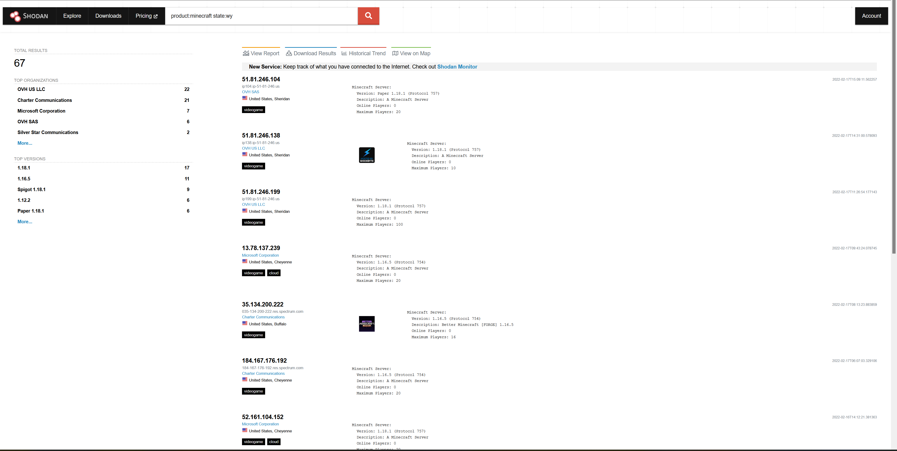
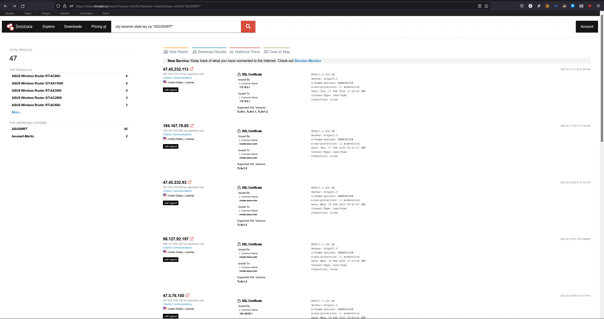

# Danny Radosevich
# BHG Lab 3 Submission

### 1. Create a shodan.io account using your UWYO.EDU email address
* I already had a paid account under my non UW email, so I used that
### 2. PLAY AND EXPLORE - Use the information from http://help.shodan.io (Links to an external site.)  to get started 
Publically facing Minecraft servers in Wyoming
 
Asus routers in Laramie

### 3. Visit https://developer.shodan.io/api (Links to an external site.) and look at the search, utility, and API status methods, create a table (in excel) with the following columns (RequestUrlEndpoint, Number of Parameters, Parameter1Name, Parameter1Type, Parameter2Name, Parameter2Type, Parameter3Name, Parameter3Type,  Parameter4Name, Parameter4Type, EXAMPLEURL), create an entry for each of the search methods
* The excel sheet is also uploaded. I went on a several hour tanget writing a python script to generate it for me. So if you want to see some regex based hell, it is in my public repo.
* Remember kids, hours of coding can save 20 minutes of copy pasting
* I have regrets, but needed the regex practice
### 4. Also uploaded spereately Radosevich_camera.out